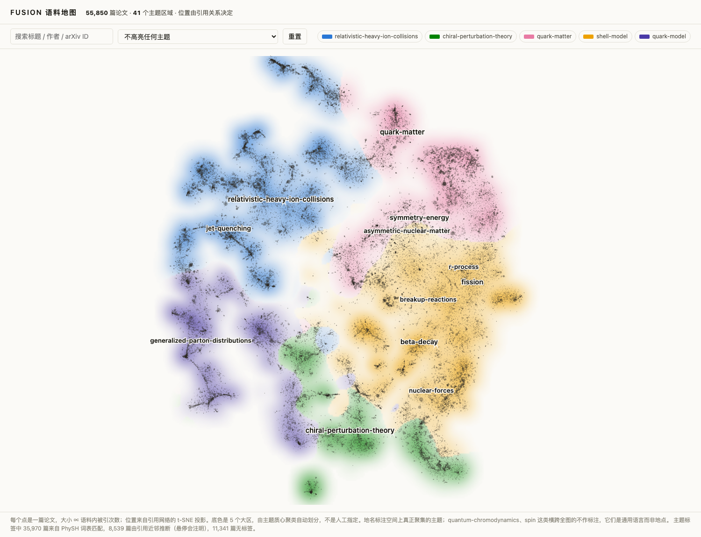

# fusion-web

FUSION 知识库的网页可视化。自包含单文件，无 CDN、无外部请求、无构建步骤，直接静态托管。



## 内容

| 文件 | 说明 |
|---|---|
| `map.html` | 语料地图，55,850 篇论文的引用投影（数据已内联，双击即可打开） |
| `index.html` | 入口页 |
| `scripts/kb_citemap.py` | 离线布局：引用邻接 → SVD → t-SNE → 2D 坐标 |
| `scripts/kb_citemap_render.py` | 渲染数据：密度场、区域划分、地名标注、标题 |
| `scripts/citemap_template.html` | 页面模板（数据以 JSON 注入） |
| `data/coords.json` | 布局坐标 |
| `data/map.json` | 渲染数据 |

## 这张图是什么

**引用图只作为布局约束，一条边都不画。** 位置来自引用关系，可见输出是论文密度地图。

这不是审美选择。大规模引用网络画成力导向节点连线图会退化成 hairball，这是目标函数决定的，调参数救不了；业界在这个量级上普遍不画全网（Connected Papers 只画种子论文的 ego 图，Open Knowledge Maps 每图上限 100 篇，VOSviewer 在 10 万篇规模下只渲染 100 个节点）。唯一真正绘制全语料的 Paperscape，走的正是"不画边"这条路。

三层结构：

1. **地形** —— 论文密度场，binned + 高斯模糊
2. **点** —— 一篇论文一个点，面积 ∝ 语料内被引次数
3. **地名** —— PhySH 主题名，标在真正聚集的主题上

**身份由地名承担，不由颜色承担。** 底色的 5 个大区是主题质心聚类自动划分的，只作辅助；5 是能通过 all-pairs 配色可达性检查的上限。地名让这张图在黑白印刷和色觉缺陷下依然可读，这也是它能直接进论文的原因。

**只有空间上真正聚集的主题才拿地名。** `quantum-chromodynamics`（7,327 篇）、`spin` 这类横跨全图的不标注 —— 它们是通用语言，不是地点。资格由离散度比值判定（≤ 0.78），不是人工挑选。

## 重新生成

需要 FUSION 语料仓库（默认在 `../FUSION`，或用 `FUSION_ROOT` 环境变量指定）。

**第一步：布局**（需要 numpy / scipy / sklearn，建议远端跑，61k 节点约 90 秒）

```bash
python3 scripts/kb_citemap.py \
    --citations <path>/citations.tsv \
    --classification <path>/classification.json \
    --min-degree 2 --svd-dims 32 --perplexity 200 \
    --no-assoc --row-normalize \
    --out data/coords.json
```

**第二步：渲染数据 + 页面**（纯 Python 标准库，本地即可）

```bash
python3 scripts/kb_citemap_render.py --titles 3000
python3 -c "
tpl=open('scripts/citemap_template.html').read()
open('map.html','w').write(tpl.replace('/*__DATA__*/null', open('data/map.json').read()))"
```

## 布局参数是调出来的，不是猜的

`kb_citemap.py` 带 `--classification` 时会自报**主题聚集度**（同主题论文的空间离散度 / 全局离散度，1.0 = 随机，越低越好）。实测扫描结果：

| 配置 | 聚集度 |
|---|---|
| perp=200, dims=32, 无 assoc 归一化, 行归一化 | **0.663** |
| perp=25, dims=32, 同上 | 0.682 |
| dims=256, **有** assoc 归一化 | 0.916 |
| dims=64, 有 assoc 归一化（初始配置） | 0.927 |

**关键发现：association-strength 归一化（`s_ij = 2m·c_ij/(c_i·c_j)`）在这条管线上是有害的**，关掉它是唯一起决定作用的变量（0.927 → 0.723）。该归一化出自 VOSviewer 的映射目标函数，不适用于 SVD + t-SNE。

0.663 这个中位数掩盖了双峰分布：真正有家园的主题在 **0.34–0.60**（jet-quenching 0.34、beta-decay 0.52、symmetry-energy 0.54），而 spin、QCD 这类词汇在 1.0 附近。

## 已知限制

- **引用边不是权威数据**。由 tex 源码正则抽取（Tier A：arXiv ID / DOI；Tier B：作者-年份启发式解析 `\cite{}` key），Tier B 有误配风险。当探索用可以，别拿来做引用统计。
- **主题标签覆盖不全**。55,850 篇中 35,970 篇来自 PhySH 词表匹配，8,539 篇由引用近邻投票推断（悬停会注明"由邻近论文推断"），11,341 篇无标签。`kb_classify.py` 靠 FTS5 关键词匹配，老论文用词与现代 PhySH 词表对不上，漏标有**年代偏向**，不是随机噪声。
- **degree < 2 的论文被排除**（3,360 篇，5.7%）。
- **2D 投影本身有损**，超过两维的结构不可见。t-SNE 的簇间距离不可直接解读为相似度。
- 标题只内联被引最高的 3,000 篇，其余悬停显示 arXiv ID（全量标题会让单文件再增约 6 MB）。

## 数据来源

FUSION 知识库：61,171 篇 arXiv nucl-th 全文语料，727,841 条语料内引用边，PhySH 主题分类。
