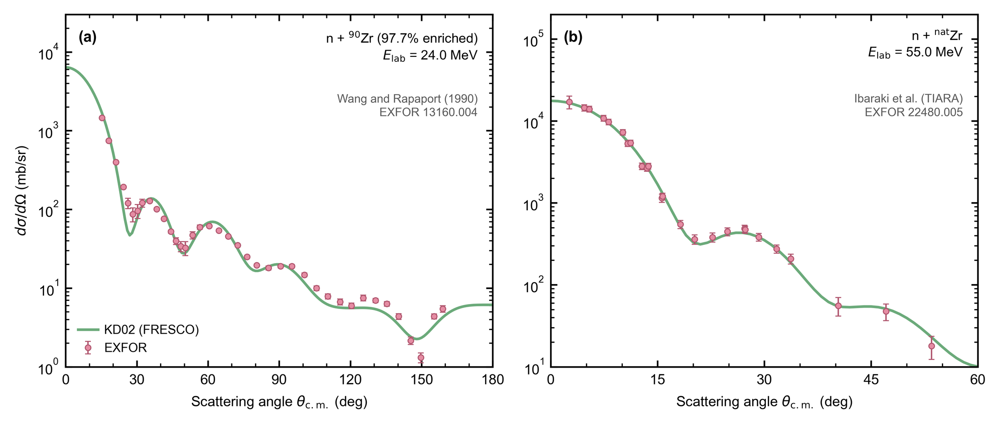
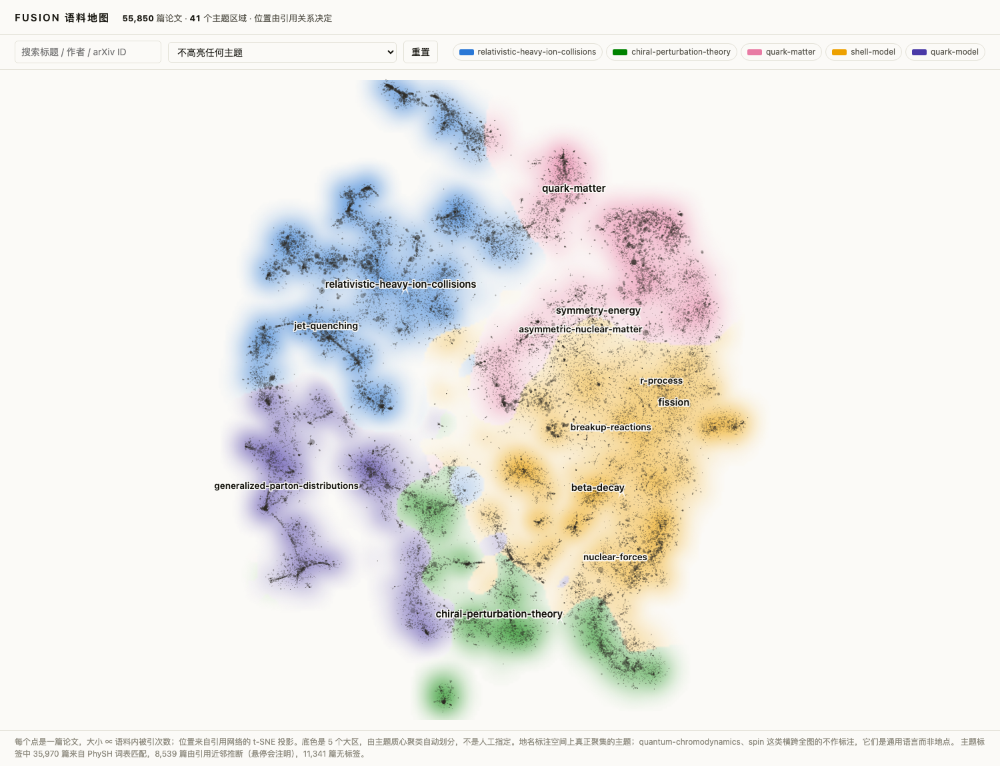

<div style="text-align:center; margin: 0 auto 34px">
<div class="fusion-mark" style="font-size:3.2rem">FU <span style="letter-spacing:-0.04em"><span style="color:#2f7fb8">&#9656;</span><span style="color:#c8791a">&#9666;</span></span> SION</div>
</div>

# 让 agent 正确驱动核物理程序

<div style="text-align:center; margin-top: 6px">
<p style="font-size:1.05rem">并且能证明它没有算错</p>
</div>

<div style="text-align:center; margin-top: 46px">
<span class="meta">金磊　同济大学物理科学与工程学院　jinl@tongji.edu.cn</span>
</div>

<div style="text-align:center; margin-top: 12px">
<a href="/talk/en/" class="meta lang-switch">English version</a>
</div>

<!--
中心信息：这个报告不是介绍一个软件，是介绍一个可验证性问题以及它的一种解法。

开场话术：今天讲的东西跟我平时讲的反应理论不一样，但问题是同一个问题的另一面。我们每天都在跑别人写的程序，而判断一个程序的输出对不对，这件事本身从来没有被系统化过。

时间：0:00 到 0:40。

转场：先问在座各位一个问题。
-->

---
layout: center
---

# 跑一个你没跑过的核物理程序，要做四件事

<div class="grid grid-cols-4 gap-5 mt-12">

<div class="kami-card">
<div class="ui-label">第一步</div>
<div style="font-size:1.05rem; margin-top:8px">找到源码</div>
<div class="fig-caption" style="margin-top:10px">作者主页、附录、邮件索取</div>
</div>

<div class="kami-card">
<div class="ui-label">第二步</div>
<div style="font-size:1.05rem; margin-top:8px">编译通过</div>
<div class="fig-caption" style="margin-top:10px">编译器版本、依赖、平台差异</div>
</div>

<div class="kami-card">
<div class="ui-label">第三步</div>
<div style="font-size:1.05rem; margin-top:8px">写对输入</div>
<div class="fig-caption" style="margin-top:10px">300 页手册，或者没有手册</div>
</div>

<div class="kami-card kami-card-accent">
<div class="ui-label">第四步</div>
<div style="font-size:1.05rem; margin-top:8px">判断结果对不对</div>
<div class="fig-caption" style="margin-top:10px">没有人告诉你</div>
</div>

</div>

<div class="takeaway mt-12">这四步里，只有第四步是物理。</div>

<!--
中心信息：跑程序的绝大部分工作量不是物理，而判断对错这一步恰恰没有任何工具支持。

讲什么：请听众回忆自己第一次跑 FRESCO 或者 TALYS 的经历。前三步是纯粹的时间消耗，痛苦但有限，卡住了你知道自己卡住了。第四步不一样，它没有报错，没有进度条，没有任何信号。

时间：0:40 到 2:00。

转场：前三步和第四步的区别，不是难度上的区别，是性质上的区别。
-->

---
layout: fact
---

# 前三步是麻烦

# <span style="color: var(--color-gap)">第四步是危险</span>

<div style="max-width: 720px; margin: 40px auto 0">
<p style="font-size:1.05rem; line-height:1.85">编译不过，你知道自己失败了。<br>输入写错到程序拒绝运行，你也知道自己失败了。<br><br><b>输入写错但程序照常运行，你不知道。</b></p>
</div>

<!--
中心信息：唯一危险的失败模式是那种不报错的失败。

讲什么：这是整场报告的支点。前三步的失败是自曝的，第四步的失败是沉默的。而我们的领域里，绝大多数输入卡的错误都属于第四类：程序接受了它，跑完了，给了一个量纲正确、形状合理、数量级也对的结果。

时间：2:00 到 3:00。

转场：给一个具体的例子，就是我们组每个学生第一年都会踩的那个坑。
-->

---

# 一个具体的坑：半径约定

<div class="grid grid-cols-2 gap-8 mt-8">

<div class="kami-card">
<div class="ui-label">FRESCO 怎么造半径</div>

```
R = r0 * (Ap^1/3 + At^1/3)
```

<div class="fig-caption" style="margin-top:12px">投射粒子和靶核都进入半径</div>
</div>

<div class="kami-card">
<div class="ui-label">KD02 和 CH89 怎么定义半径</div>

```
R = r0 * At^1/3
```

<div class="fig-caption" style="margin-top:12px">只有靶核，这是全局光学势的通行约定</div>
</div>

</div>

<div class="box-idea mt-8">

修正只有一处：`type=0` 那一行里写 `ap=0`。这一行即使对中子也必须存在，因为声明半径约定的正是它。

</div>

<div class="takeaway mt-8">这不是物理分歧，是两套记号在同一个输入卡里相遇。</div>

<!--
中心信息：一个纯记号层面的约定差异，足以让整个计算错掉，而且它不在任何一篇论文里。

讲什么：Koning-Delaroche 的论文里当然写了半径怎么定义。FRESCO 的手册里当然也写了它怎么造半径。两件事都是公开的，但没有任何一份文档告诉你，把它们接在一起的时候需要 ap=0。这个知识存在于用过这两个东西的人的脑子里。

时间：3:00 到 4:30。

转场：忘了这一行会怎么样。
-->

---

# 忘掉这一行会发生什么

<div class="grid grid-cols-3 gap-6 mt-10">

<div v-click class="kami-card">
<div class="ui-label">半径</div>
<div style="font-size:2.4rem; font-weight:500; color: var(--color-gap); margin-top:8px">+22%</div>
<div class="fig-caption" style="margin-top:10px">核子入射时，每一个半径都偏大约 22%</div>
</div>

<div v-click class="kami-card">
<div class="ui-label">程序</div>
<div style="font-size:2.4rem; font-weight:500; margin-top:8px">正常退出</div>
<div class="fig-caption" style="margin-top:10px">没有警告，没有非零返回码</div>
</div>

<div v-click class="kami-card">
<div class="ui-label">截面</div>
<div style="font-size:2.4rem; font-weight:500; margin-top:8px">看上去合理</div>
<div class="fig-caption" style="margin-top:10px">量纲对，角分布形状对，数量级对</div>
</div>

</div>

<div v-click class="box-gap mt-10">

同一类沉默失败在这一个程序里至少还有两个：面项 `W_d` 写进 `type=2` 的 `p1` 而不是 `p4`，它就变成一个实的面势阱，吸收悄悄掉下去；`type=0` 整行漏掉，半径约定就没有被声明。

</div>

<!--
中心信息：错误的代价是 22%，而所有可观察的信号都指向"成功"。

讲什么：22% 这个数字值得停一下。它不是差一个数量级那种一眼就能看出来的错，也不是万分之一那种无所谓的错。它正好落在"你会相信它"和"它会毁掉你的结论"之间。

如果听众里有做实验的：这个量级的偏差比很多实验的系统误差还大。

时间：4:30 到 6:00。

转场：现在把通用 AI 放进这个场景。
-->

---

# 通用 agent 恰好会犯这个错

<div class="grid gap-8 mt-8" style="grid-template-columns: 1fr 1fr;">

<div>

<div class="box-gap">

问它要一份 FRESCO 输入卡，它会给你一份**看起来完全正确**的文件。deck 能跑。截面错 20%。没有任何东西警告你。

</div>

<div class="fig-caption" style="margin-top:20px; line-height:1.8">
它并不是不懂物理。Koning-Delaroche 的公式它背得比我熟，FRESCO 的 namelist 结构它也清楚。它缺的是那条从来没有被写下来的接缝知识。
</div>

</div>

<div v-click>

<div class="kami-card-accent">
<div class="ui-label">为什么这比人犯错更麻烦</div>
<div style="margin-top:12px; line-height:1.9; font-size:0.95rem">
一个学生犯这个错，会在组会上被问住，然后改掉。<br><br>
一个 agent 犯这个错，它会用完全一致的自信语气把结果交给你，而且下一次还会犯，因为它没有地方记住这件事。
</div>
</div>

</div>

</div>

<!--
中心信息：通用 agent 的失败模式恰好落在最危险的那一类，而且它不积累经验。

讲什么：这里要小心措辞，不要变成嘲讽某个模型。这不是模型能力问题，换一个更大的模型也一样，因为缺的不是推理能力，是一条没有进入任何训练语料的口头知识。

时间：6:00 到 7:30。

转场：所以问题就变成了，这类知识应该放在哪里。
-->

---
layout: fact
---

# 修法不是更大的模型

<div style="max-width: 780px; margin: 36px auto 0">

<div class="box-idea">

把每个程序的领域知识，连同**一条带容差的基准**，固化成一份可以被读、被审、被别人修改的文档。

</div>

<p style="margin-top: 28px; font-size:1rem; line-height:1.85; color: var(--olive)">缺的不是推理能力，是那些从来没被写下来的东西：这个程序的记号约定、它的沉默失败模式、以及一个已知答案，好让人能验证这次构建确实复现了它。</p>

</div>

<!--
中心信息：全场唯一必须被记住的一句话。

讲什么：说得慢一点。这句话的重点在"带容差的基准"上，前半句很多人都想得到，后半句才是这个项目和一堆 prompt 工程的区别。没有基准，你只是换了一种方式相信 AI。

时间：7:30 到 8:30。

转场：FUSION 就是这句话的一个实现。
-->

---
layout: section
---

# 二、FUSION 怎么做

<!--
时间：8:30。快速过。
-->

---

# 一个程序，一份专家技能

<div class="grid grid-cols-3 gap-5 mt-10">

<div class="kami-card">
<div class="ui-label">01 装</div>
<div class="fig-caption" style="margin-top:10px; line-height:1.7">从作者自己的上游源码构建，不是从缓存里拷一份</div>
</div>

<div class="kami-card">
<div class="ui-label">02 写</div>
<div class="fig-caption" style="margin-top:10px; line-height:1.7">按这个程序的记号约定生成输入，包括所有接缝</div>
</div>

<div class="kami-card">
<div class="ui-label">03 跑</div>
<div class="fig-caption" style="margin-top:10px; line-height:1.7">带上正确的工作目录和运行时前提</div>
</div>

<div class="kami-card">
<div class="ui-label">04 读</div>
<div class="fig-caption" style="margin-top:10px; line-height:1.7">解析输出格式，取出真正要的那一列</div>
</div>

<div class="kami-card">
<div class="ui-label">05 认</div>
<div class="fig-caption" style="margin-top:10px; line-height:1.7">识别这个程序已知的沉默失败模式</div>
</div>

<div class="kami-card kami-card-accent">
<div class="ui-label">06 验</div>
<div class="fig-caption" style="margin-top:10px; line-height:1.7">对着一个已知答案检查，容差写在文档里</div>
</div>

</div>

<div class="takeaway mt-10">前五件事决定它能不能用，第六件事决定你能不能信。</div>

<!--
中心信息：技能不是一段提示词，是一条从安装到验证的完整链路，终点是一个可复核的数字。

讲什么：强调第六步和前五步的地位不一样。前五步任何一个认真的封装都会做，第六步是这个项目愿意承担的额外成本，也是唯一能把"方便"变成"可信"的一步。

时间：8:40 到 10:00。

转场：这些技能到底长什么样，不抽象讲，直接看一段。
-->

---

# 技能就是文档，不是模型

<div class="ui-label">skills/fresco/SKILL.md，原文</div>

<div class="kami-card" style="margin-top:14px">
<div style="font-size:0.88rem; line-height:1.85; color: var(--charcoal)">
<b>为什么要用这个脚本，而不是自己敲参数。</b>公式不是难点，难点是接进 FRESCO 的那一步。有三件事会静默出错，也就是说 deck 照样能跑，并打印出一个看似合理但错误的截面：
<br><br>
<b>· 半径约定。</b>FRESCO 造半径用 <code>R = r0*(Ap^1/3 + At^1/3)</code>，而 KD02 和 CH89 都定义在 <code>R = r0*At^1/3</code> 上。修正是 <code>type=0</code> 那行里的 <code>ap=0</code>，脚本总是会写出这一行。核子入射时弄错，每个半径都会大约 22% 偏大。
<br><br>
<b>· 面项是虚的。</b><code>W_d</code> 进 <code>type=2</code> 行的 <code>p4</code>，不是 <code>p1</code>。写进 <code>p1</code> 它就变成一个实的面势阱，吸收会悄悄下降。
</div>
</div>

<div class="grid grid-cols-3 gap-5 mt-8">
<div v-click class="fig-caption">纯 Markdown 加 shell，没有权重，没有二进制</div>
<div v-click class="fig-caption">可以被审阅，可以被反驳，可以被 pull request 修改</div>
<div v-click class="fig-caption">可以印出来贴在学生的桌子上</div>
</div>

<!--
中心信息：让听众亲眼确认这东西是可审计的散文，不是一个黑盒。

讲什么：这一页是整个第二部分最重要的一页。核物理听众对 AI 的第一反应是"我没法检查它"，这一页正面回答这件事。请他们注意，这段文字本身就是一份可以给新学生看的教学材料，跟 agent 无关也成立。

时间：10:00 到 11:30。

转场：这样的技能现在有多少份。
-->

---

# 覆盖了哪些程序

<div class="mt-6" style="font-size:0.93rem">

| 领域 | 程序 |
|---|---|
| 反应、光学模型 | FRESCO（含 SFRESCO 拟合）、COLOSS、CCFULL、pikoe、NLAT、CNOK、SIDES、SWANLOP |
| 结构、从头算 | GSM、KSHELL、NuclearToolkit.jl、Sky3D |
| 裂变、统计模型 | CGMF、TALYS |
| 核天体、R 矩阵 | AZURE2、SkyNet |
| 重离子输运、状态方程 | SMASH、GiBUU、Thermal-FIST、vHLLE |

</div>

<div class="grid grid-cols-2 gap-8 mt-8">

<div class="box-idea">

**20** 份驱动具体程序的技能。另有 **6** 份：SFRESCO 拟合、EXFOR 实验数据检索、离线语料检索、两份个人研究 wiki 维护、以及一份初始化。合计 **26**。

</div>

<div class="fig-caption" style="line-height:1.8">
收录标准只有三条，写在 CLAUDE.md 里：公开可获取、能从源码在目标平台上构建、有已发表的论文。<br><br>没有诚实的基准等级，技能就不发布。
</div>

</div>

<!--
中心信息：覆盖面是按物理领域组织的，而且收录有门槛。

讲什么：不要念表格。挑听众所在的方向点两个，比如做反应的就说 FRESCO 和 COLOSS，做重离子的就说 SMASH 和 vHLLE。

口径提醒：全场统一，20 是程序技能，26 是全部技能，不要混。

时间：11:30 到 12:30。

转场：还有一个大家一定会问的问题，它绑不绑定某一个 AI。
-->

---

# 不绑定 agent，也不绑定模型

<div class="grid grid-cols-2 gap-8 mt-8">

<div>

<div class="ui-label">三个常见 agent 都能加载</div>

<div class="mt-4" style="font-size:0.92rem">

| Agent | 入口 | 状态 |
|---|---|---|
| opencode | `SKILL.md` | 已验证，零配置 |
| Claude Code | `SKILL.md` | 已验证 |
| Codex | `AGENTS.md` | 仅格式，未端到端测试 |

</div>

<div class="fig-caption" style="margin-top:16px">技能是目录，不是插件，所以移植成本接近零。</div>

</div>

<div>

<div class="box-idea">

底座是 opencode，所以你能连上的模型它都能跑：**DeepSeek、Qwen、GLM**，和 Claude 或 GPT 一样直接。

</div>

<div class="kami-card" style="margin-top:22px">
<div class="ui-label">Phase 0 验收，用的就是国产模型</div>
<div style="margin-top:10px; font-size:0.95rem; line-height:1.8">
在 deepseek-chat 上，独立写出 n+<sup>90</sup>Zr 弹性散射的 FRESCO 输入卡，结果与参考计算一致到 <b>4 到 5 位有效数字</b>。
</div>
</div>

</div>

</div>

<!--
中心信息：这套东西不依赖某一家的模型，国内可用，而且验收就是在国产模型上做的。

讲什么：国内听众一定会关心这个，主动答掉，不要等提问。重点是技能把领域知识外置了，所以对模型能力的要求反而下降了。

时间：12:30 到 13:30。

转场：说得再多不如跑一次。
-->

---
layout: section
---

# 三、现场演示

<div style="max-width: 640px; margin: 30px auto 0; text-align:left">

<div class="kami-card-accent">
<div class="ui-label">交给它的原话</div>
<div style="margin-top:12px; font-size:1.02rem; line-height:1.8">
算 50 MeV 的 n+<sup>90</sup>Zr 弹性散射，用 KD02 全局光学势，然后跟 EXFOR 上有的实验数据比一下。
</div>
</div>

</div>

<!--
中心信息：一句自然语言，覆盖找参数、写输入、编译、运行、解析、找数据、作图七件事。

讲什么：把这句话念出来，然后停两秒再切屏。让听众意识到这句话里没有任何一个文件名、路径或者参数。

演示注意：屏幕切过去之前先确认终端字号足够大。如果 30 秒内没有实质进展，直接切录屏，不要解释，不要道歉。

时间：13:30 到 24:00，共 10 分半。演示后面紧跟着产出图那一页。

转场：演示结束后回到这里说，刚才那一步里最值得看的其实不是它跑通了，是它在跑通之后做了什么。
-->

---
layout: center
---

<div style="text-align:center">
<div class="ui-label">现场演示</div>
<h1 style="margin-top:20px">切换到终端</h1>
<p style="margin-top:24px; color: var(--olive)">备份录屏：<code>demo-n90zr.mp4</code></p>
</div>

<!--
这一页只是占位，正常情况下不会停留。

如果演示失败：切到录屏，一句话带过"网络不太配合，我放剪好的版本"，然后继续讲。不要现场调试。

演示要覆盖的四个节点，讲的时候点出来：
1. 它自己去找 KD02 参数，用的是本地那份 Koning 原始 kd02.f，不是凭记忆重写公式
2. 它写出 ap=0
3. 它做了步长和分波数的收敛检查
4. 它去查 EXFOR，然后告诉你 50 MeV 没有数据
-->

---

# 演示产出的那张图

<div class="fig-caption" style="text-align:left; margin-bottom:10px">绿线是 KD02 全局光学势的零自由参数预测，粉点是 EXFOR 实测。两个面板各自按它的实验能量重新算过。</div>



<div class="grid grid-cols-3 gap-5 mt-4">

<div class="kami-card" style="padding:14px 18px">
<div class="ui-label nocaps">左 · 24 MeV</div>
<div style="margin-top:6px; font-size:0.87rem">富集 <sup>90</sup>Zr，全角度。中位比 <b>0.89</b></div>
</div>

<div class="kami-card" style="padding:14px 18px">
<div class="ui-label nocaps">右 · 55 MeV</div>
<div style="margin-top:6px; font-size:0.87rem">天然 Zr，只有前角。χ²/N = <b>0.75</b></div>
</div>

<div class="kami-card kami-card-accent" style="padding:14px 18px">
<div class="ui-label nocaps">中间 · 50 MeV</div>
<div style="margin-top:6px; font-size:0.87rem"><b>没有这一格，那个能量没有测量</b></div>
</div>

</div>

<!--
中心信息：演示的产物不只是一条曲线，还包括一句"这里没有数据"。

讲什么：先讲图本身，零自由参数，两个能量都不是拟合出来的。然后把重点放到第三张卡上：任务给的是 50 MeV，EXFOR 里 50 MeV 什么都没有，所以它改到两个真有数据的能量重算，并且如实报告这个空缺。

一个会做研究的人在这一步会做的事，正是把"没有数据"当成结果的一部分交出来，而不是找一个最近的能量假装那就是。这一页值得多停十秒。

时间：24:00 到 25:30，接在演示后面。

转场：讲完这张图，问题就变成了，凭什么信它给的这条绿线。
-->

---
layout: section
---

# 四、凭什么信它

<!--
时间：25:30。

这一部分是整场报告的学术重心。前面讲的是方便，从这里开始讲的是可信。如果时间紧张，宁可压缩第五部分也不要压缩这里。
-->

---

# 两级证据，写在每份技能的封面上

<div class="grid grid-cols-2 gap-8 mt-8">

<div class="kami-card">
<div class="ui-label">Tier 1　14 份</div>
<div style="margin-top:12px; font-size:0.97rem; line-height:1.85">
程序自己的发行版里带了参考值或测试套件，技能把它复现出来。<br><br>
其中几份是<b>逐位相同</b>，不是"在误差范围内一致"。
</div>
</div>

<div class="kami-card">
<div class="ui-label">Tier 2　6 份</div>
<div style="margin-top:12px; font-size:0.97rem; line-height:1.85">
程序不提供任何参考输出。于是改用别的东西钉住它：跨平台复现、物理恒等式、或者一个独立的解析解。<br><br>
证据链换了，但不允许没有。
</div>
</div>

</div>

<div class="box-idea mt-10">

分级本身是公开的。每份技能在自己的 `references/verification.md` 里写清楚：等级、用什么钉的、容差多少、以及已知的失败模式。

</div>

<!--
中心信息：可信度是分级的、公开的、逐条可查的，不是一句"我们测试过了"。

讲什么：Tier 2 这一栏是关键。很多程序根本不带参考输出，这时候诚实的做法不是降低标准，是换一条证据链。下一页给两个具体例子。

时间：25:30 到 27:00。

转场：抽象的分级不解决问题，看两个具体的。
-->

---

# 两个例子

<div class="grid grid-cols-2 gap-8 mt-6">

<div>

<div class="ui-label" style="color: var(--color-evidence)">Tier 1 · CNOK</div>

<div class="kami-card" style="margin-top:12px">
<div style="font-size:0.93rem; line-height:1.8">
<sup>16</sup>C 剥去一个中子，239 MeV/u 打 <sup>12</sup>C。剥离与衍射解离截面：
<br><br>
<code style="font-size:0.85rem">60.086689 / 18.056073 / 78.142761 mb</code>
<br><br>
在<b>四种不同构建</b>下逐位相同：macOS/clang 打补丁的 -O2 与 -O0，Linux/gcc 未打补丁与打补丁。剥离道与论文里的 60.087 mb 精确吻合。
</div>
</div>

<div class="fig-caption" style="margin-top:14px">未打补丁的 gcc 与打了补丁的 clang 逐位相同，这一点才是补丁只改了可移植性、没有改物理的证明。</div>

</div>

<div>

<div class="ui-label" style="color: var(--color-evidence)">Tier 2 · vHLLE 与 AZURE2</div>

<div class="kami-card" style="margin-top:12px">
<div style="font-size:0.93rem; line-height:1.8">
vHLLE 不带参考输出，于是拿<b>闭式 Gubser 流</b>去对，而不是拿它自己的输出去对。
<br><br>
AZURE2 用论文表格里的 9 个参数直接重建 <sup>16</sup>O(p,γ)<sup>17</sup>F，<b>不做任何拟合</b>：S(90 keV) 偏差 −5.7%，对实测数据 χ²/N = 1.53。
</div>
</div>

<div class="fig-caption" style="margin-top:14px">−5.7% 被原样写进文档。一个不做拟合的重建本来就该有这个量级的残差，把它藏起来才是问题。</div>

</div>

</div>

<!--
中心信息：具体的基准比分级表有说服力，而且残差是被公开的。

讲什么：CNOK 那个四种构建逐位相同的论证要讲清楚，它是个漂亮的逻辑：我们为了在 macOS 上编译打了两个补丁，怎么证明补丁没改物理？让没打补丁的 gcc 构建和打了补丁的 clang 构建给出逐位相同的结果。

AZURE2 那个 −5.7% 要主动说出来，这是建立信任的地方。

时间：27:00 到 29:00。

转场：还有一种更强的检查方式，用第二个程序。
-->

---

# 用第二个求解器互检

<div class="grid gap-8 mt-8" style="grid-template-columns: 3fr 2fr;">

<div>

<div class="ui-label nocaps">n+<sup>90</sup>Zr 弹性散射，50 MeV，KD02</div>

<div class="mt-4" style="font-size:0.93rem">

| 检查 | 结果 |
|---|---|
| 积分步长连续减半两次 | 稳定到 **9 位有效数字** |
| 匹配半径与分波数加倍 | 结果不变 |
| COLOSS（复标度 Lagrange-Laguerre） | 1299.188 mb |
| FRESCO（Numerov 耦合道） | 1299.191 mb |
| 两者一致 | **6 位有效数字** |
| 令 W = 0 | 吸收精确归零，通量守恒 |

</div>

</div>

<div>

<div class="box-evidence">

两个求解器在**结构上毫无关系**：一个是复标度的 Lagrange-Laguerre 基展开，一个是实轴上的 Numerov 积分。它们不共享代码，不共享离散化，也不共享边界条件处理。

</div>

<div class="fig-caption" style="margin-top:18px; line-height:1.8">
所以它们一致到 6 位，排除的不是舍入误差，是两边各自的实现错误。
</div>

</div>

</div>

<!--
中心信息：数值收敛只证明你算稳了，独立实现的一致才证明你算对了。

讲什么：这一页对做数值的听众最有说服力。收敛检查是自洽性，只能排除离散化误差；换一个结构上不同的求解器，才能排除实现错误。W=0 归零那一条是物理恒等式检查，第三种独立证据。

时间：29:00 到 30:30。

转场：验证到底能做多深，讲一个我自己都没想到的例子。
-->

---

# 验证做到什么深度

<div class="box-gap mt-6">

把 KD02 参数化对着 Koning 自己的 `kd02.f` 逐值核对，39 个钉住的值里，CH89 精确到机器精度，**KD02 只到大约 7 位就停住了**。

</div>

<div class="grid grid-cols-2 gap-8 mt-8">

<div v-click>

<div class="ui-label">原因找到了</div>

<div style="margin-top:12px; font-size:0.93rem; line-height:1.85">
那份 <code>kd02.f</code> 凡是 Fortran 允许的地方都是单精度。变量声明是 <code>real*8</code>，但这并不让运算变成双精度：
<br><br>
字面量被截断，<code>59.30</code> 进去变成 <code>59.2999992370605</code>；<code>1./3.</code> 是一次单精度除法；<code>real(N-Z)</code> 没带 kind，掉回 <code>real(4)</code>。
</div>

</div>

<div v-click>

<div class="box-evidence">

把参考的 `kd02.f` 用 `-fdefault-real-8` 重新编译，两边吻合到 **16 位**。

</div>

<div style="margin-top:14px; font-size:0.9rem; line-height:1.8">
也就是说，<b>更准的那一个是技能里的实现，残差属于那份 Fortran</b>。
<br><br>
这在物理有意义的三四位上完全不重要。但写下来之后，任何超过 2×10⁻⁷ 的偏差就都是真 bug。
</div>

</div>

</div>

<!--
中心信息：把参考值和自己的实现对到底，你会发现参考值本身也有故事，而这恰恰是把容差定在哪里的依据。

讲什么：这一页是我个人最喜欢的一个发现，可以稍微放松一点讲。它说明"复现参考值"这件事做认真了会走多远。更重要的是结论那一句：正因为这 7 位的来源被查清楚了，容差才能定在 2e-7，超过它就是真错误。

如果听众是做数值的，这一页会引起共鸣，可以多停 15 秒。

时间：30:30 到 32:00。

转场：还有一层检查，是让另一个 AI 来拆自己的台。
-->

---

# 出厂前让另一个 AI 来拆台

<div class="fig-caption mt-4">每份技能发布前都要过一次对抗审查。这不是仪式，下面是它真的抓到的东西。</div>

<div class="grid grid-cols-3 gap-5 mt-8">

<div v-click class="kami-card">
<div class="ui-label" style="color: var(--color-gap)">TALYS</div>
<div style="margin-top:10px; font-size:0.9rem; line-height:1.75">
<code>run_talys.sh</code> 会跑一份<b>旧的输入卡然后报告成功</b>。源目录为空加上遗留的工作目录，拷贝因为 <code>|| true</code> 静默失败，TALYS 跑了上一次的 <code>talys.inp</code>，退出码 0。
</div>
<div class="fig-caption" style="margin-top:12px">这正是这份技能存在的目的所反对的那一类假阳性，出现在了技能自己的脚本里。</div>
</div>

<div v-click class="kami-card">
<div class="ui-label" style="color: var(--color-gap)">GiBUU</div>
<div style="margin-top:10px; font-size:0.9rem; line-height:1.75">
一个自检标记在 <code>case</code> 语句里用了正则的或（<code>non-numeric\|not finite</code>），而 <code>case</code> 匹配的是通配符不是正则。
<br><br>
<b>它永远不可能触发。</b>
</div>
<div class="fig-caption" style="margin-top:12px">一个从来没有失败过的测试，和一个不存在的测试，是同一件事。</div>
</div>

<div v-click class="kami-card">
<div class="ui-label" style="color: var(--color-gap)">SMASH</div>
<div style="margin-top:10px; font-size:0.9rem; line-height:1.75">
身份校验和 ctest 自检块在<b>伪造自己的输入</b>：用真实构建戳记的 <code>head -1</code> 合成一个戳记，而 Linux 构建早于该戳记，文件根本不存在，合成结果塌缩成一行。
</div>
<div class="fig-caption" style="margin-top:12px">八个用例是对着一个被自己发明出来的输入失败的。移到 Linux 上才暴露。</div>
</div>

</div>

<!--
中心信息：验证体系自己也会骗自己，所以必须有一层专门用来拆台的检查。

讲什么：这三条不要一带而过，它们是这场报告里最能建立可信度的内容，因为它们是自己揭自己的短。特别是 TALYS 那条，明确说出来：这个项目存在的理由就是防止假阳性，而假阳性出现在了它自己的脚本里。

如果有人问"那审查者本身怎么保证"，诚实回答：保证不了，所以还有跨平台和物理恒等式两层，任何单层都不足够。

时间：32:00 到 34:00。

转场：跨平台这件事本身也贡献了一个意外发现。
-->

---

# 平台差异不是噪音，是证据

<div class="grid gap-8 mt-8" style="grid-template-columns: 1fr 1fr;">

<div>

<div class="ui-label">SMASH，Au+Au 输运</div>

<div class="box-gap" style="margin-top:12px">

源码、输入、随机种子完全相同，部分粒子多重性在 macOS 与 Linux 之间最多相差 **25%**。

</div>

<div class="box-evidence" style="margin-top:18px">

而重子数 **B = 788** 与电荷 **Q = 316** 在两个平台上都是精确的整数，一动不动。

</div>

</div>

<div v-click>

<div class="kami-card-accent">
<div class="ui-label">于是验证器改了锚点</div>
<div style="margin-top:12px; font-size:0.95rem; line-height:1.85">
不再把依赖平台的多重性当成标准答案，改成锚在守恒律上。<br><br>
同一次检查还顺带发现，旧规则会把轻核的 PDG 编码判成重子数 0。
</div>
</div>

<div class="fig-caption" style="margin-top:18px">Linux 上 104 项测试全部通过。</div>

</div>

</div>

<div class="takeaway mt-8">如果只在一个平台上验证，这 25% 会被当成"标准答案"写进文档。</div>

<!--
中心信息：跨平台不是工程上的洁癖，它能告诉你哪些数字是物理，哪些数字是实现。

讲什么：这个例子很有意思，因为它把"什么可以当基准"这个问题问清楚了。多重性在这里是平台相关的，不能当基准；守恒律是精确整数，可以。这个判断只有跑过两个平台才做得出来。

时间：34:00 到 35:30。

转场：讲完这些，必须说一句最重要的限制。
-->

---
layout: fact
---

# 基准证明的是这次构建复现了一个已知结果

# <span style="color: var(--color-gap)">它不证明你的计算是对的</span>

<div style="max-width: 720px; margin: 40px auto 0">
<p style="font-size:1.05rem; line-height:1.85">选哪个光学势，怎么切断连续态，能量范围合不合适，这些还是你的事。<br><br><b>物理仍然是你的。</b></p>
</div>

<!--
中心信息：明确划出这套东西的能力边界，主动交还责任。

讲什么：这一页要用最平实的语气讲，不要有任何辩解的意味。它替你把工具层的错误挡掉了，物理判断一步都没有替你做。

这一页会赢得在座资深同行的信任，比前面所有页加起来都管用。

时间：35:30 到 36:30。

转场：讲完程序，讲另一半，文献。
-->

---
layout: section
---

# 五、离线的文献层

<!--
时间：36:30。这一部分如果超时可以压缩，但地图那页值得留。
-->

---

# 61,167 页，离线，用 grep 读

<div class="grid gap-8 mt-8" style="grid-template-columns: 1fr 1fr;">

<div>

<div class="kami-card">
<div class="ui-label">语料</div>
<div style="margin-top:12px; font-size:0.95rem; line-height:1.85">
61,059 篇 arXiv nucl-th 论文，一篇一页，加 108 个主题页，再加引用层和语义关系层。
<br><br>
没有服务器，没有 API key，没有网络。
</div>
</div>

<div class="box-gap" style="margin-top:18px">

这些页面是机器生成的摘要，**它们会错**。引用请引论文，不要引页面。

</div>

</div>

<div>

<div class="ui-label">一个真实任务：只给一篇 PDF</div>

<div style="margin-top:12px; font-size:0.92rem; line-height:1.8">
输入是 Abu-Ibrahim 等，<i>PRC</i> <b>77</b>, 034607，碳同位素在质子靶上的反应截面。全程离线，零外部调用。
<br><br>
语料先把它定位到 <code>0710.4193</code>，引用网络给出它引的 <b>8 篇</b>和引它的 <b>5 篇</b>，其中包括同组前作和 <sup>22</sup>C 双中子晕的工作。现成摘要里带着可以直接核对的数字：p+<sup>12</sup>C 在 40 MeV 的 σ<sub>R</sub> = 432 mb。
</div>

<div class="box-gap" style="margin-top:16px">

<b>限制：</b>引用边只在这批语料内统计。RIKEN 的实验论文不属于 nucl-th，所以"被引 5 次"低估了真实引用量。

</div>

</div>

</div>

<!--
中心信息：文献层的价值在于离线和可核对，同时它的两条限制必须在同一页说清楚。

讲什么：这一页的节奏是给一个能力，紧接着给它的边界。不要分开讲，也不要把限制放到最后一页去。

时间：36:30 到 38:30。

转场：这批语料还有一个可看的形态。
-->

---
layout: center
---

<div style="text-align:center">

<div class="fig-caption" style="margin-top:14px">55,850 篇论文的引用投影。地形是论文密度场，一个点是一篇论文，面积正比于语料内被引次数，地名取自 PhySH 主题。</div>
</div>

<!--
中心信息：这批语料是有结构的，而结构可以被看见。

讲什么：先让听众看 5 秒再说话。然后指出几个他们认识的区域，比如做反应的那一片在哪里，格点 QCD 在哪里。

时间：38:30 到 39:30。

转场：这张图有一个技术判断值得单独说。
-->

---

# 一条引用边都没有画

<div class="grid gap-8 mt-8" style="grid-template-columns: 1fr 1fr;">

<div>

<div class="box-idea">

引用图只作为**布局约束**，可见的输出是密度地图。

</div>

<div style="margin-top:18px; font-size:0.93rem; line-height:1.85">
这不是审美选择。这个量级的引用网络画成力导向的节点连线图，一定退化成毛球，这是目标函数决定的，调参数救不了。
</div>

<div class="fig-caption" style="margin-top:16px; line-height:1.8">
业界在这个量级上普遍回避全图：Connected Papers 只画种子论文的 ego 图，Open Knowledge Maps 每图上限 100 篇，VOSviewer 在 10 万篇规模下只渲染 100 个节点。唯一真正绘制全语料的 Paperscape，走的正是不画边这条路。
</div>

</div>

<div>

<div class="kami-card">
<div class="ui-label">身份由地名承担，不由颜色承担</div>
<div style="margin-top:12px; font-size:0.92rem; line-height:1.8">
底色的 5 个大区是主题质心聚类自动划分的，只作辅助。5 是能通过全配对可达性检查的上限。
<br><br>
地名让这张图在黑白印刷和色觉缺陷下依然可读，这也是它能直接进论文的原因。
</div>
</div>

<div class="kami-card" style="margin-top:18px">
<div class="ui-label">只有真正聚集的主题才拿地名</div>
<div style="margin-top:12px; font-size:0.92rem; line-height:1.8">
<code>quantum-chromodynamics</code> 有 7,327 篇，横跨全图，所以不标注。它是通用语言，不是地点。
<br><br>
资格由离散度比值判定，阈值 0.78，不是人工挑选。
</div>
</div>

</div>

</div>

<!--
中心信息：这张图的每一个设计决定都有理由，而且理由是可检验的，不是审美偏好。

讲什么：毛球那一段可以讲得肯定一些，这是力导向布局的已知性质。QCD 不标注那一条是个好例子：一个横跨全图的主题不是地点，是语言。

时间：39:30 到 41:00。

转场：最后讲清楚它现在还不行的地方。
-->

---

# 现在还不行的地方

<div class="grid grid-cols-2 gap-6 mt-8">

<div class="kami-card">
<div class="ui-label" style="color: var(--color-gap)">冷启动安装是测得最少的一环</div>
<div style="margin-top:10px; font-size:0.92rem; line-height:1.8">
二十个程序里，只有 FRESCO 真正从一个空缓存装起来验过。别的机器上大概率会缺依赖。
</div>
</div>

<div class="kami-card">
<div class="ui-label" style="color: var(--color-gap)">国内网络下前两步会失败</div>
<div style="margin-top:10px; font-size:0.92rem; line-height:1.8">
2026-08-13 在校园网实测：github.com 六次连接零成功，clone 在 132 秒后失败。需要代理。镜像是待解决的问题。
</div>
</div>

<div class="kami-card">
<div class="ui-label" style="color: var(--color-gap)">磁盘与平台</div>
<div style="margin-top:10px; font-size:0.92rem; line-height:1.8">
TALYS 要约 11 GB，其中 8.6 GB 是结构数据库，不要拿它当第一个试。Windows 没有构建，macOS 与 Linux 的二进制都未签名。
</div>
</div>

<div class="kami-card">
<div class="ui-label" style="color: var(--color-gap)">只有一个人用过</div>
<div style="margin-top:10px; font-size:0.92rem; line-height:1.8">
v0.1.0 是第一个公开版本。它能用，作者每天在用，但除他之外没有人用过。
</div>
</div>

</div>

<div class="takeaway mt-12">在你手上坏掉的地方，才是这次发布真正想知道的东西。</div>

<!--
中心信息：把已知的坑一次说完，不留给听众自己去踩。

讲什么：这一页语速可以快一点，但一条都不要省。特别是国内网络那条，在座大多数人真要试都会先撞上它。

时间：41:00 到 42:30。

转场：所以我最想要的反馈是什么。
-->

---

# 最想要的一类反馈

<div class="box-gap mt-10" style="max-width: 800px">

**一个看起来对、但其实错的结果。**

</div>

<div style="max-width: 800px; margin-top: 22px; font-size:1rem; line-height:1.9">
这个项目存在的全部理由，就是通用 agent 会写出一份半径约定错误的 FRESCO 输入卡。如果 FUSION 也做了同类的事，请把输入卡、那个数字、以及它本应是多少发给我。
</div>

<div class="fig-caption" style="margin-top:20px; line-height:1.8">
这是我最怕的失败，也是最不容易被报告出来的失败，因为按定义它看起来是成功的。
</div>

<div class="grid grid-cols-3 gap-5 mt-10">
<div class="kami-card">
<div class="ui-label">其次</div>
<div style="margin-top:8px; font-size:0.92rem">装不上的程序，带上报错、系统和编译器版本</div>
</div>
<div class="kami-card">
<div class="ui-label">再次</div>
<div style="margin-top:8px; font-size:0.92rem">任何让你觉得别扭的地方</div>
</div>
<div class="kami-card">
<div class="ui-label">以及</div>
<div style="margin-top:8px; font-size:0.92rem">你希望哪个程序也有一份技能</div>
</div>
</div>

<!--
中心信息：把最有价值的反馈类型直接定义清楚，降低反馈门槛。

讲什么：第三条"任何让你觉得别扭的地方"要强调一下，第一次运行流程里每一处别扭的设计，都是某一个人试了一次然后直说出来才发现的。

时间：42:30 到 43:30。

转场：最后回到开头那个问题。
-->

---
layout: center
---

<div style="text-align:center">
<div class="fusion-mark" style="font-size:2.4rem; margin-bottom:34px">FU <span style="letter-spacing:-0.04em"><span style="color:#2f7fb8">&#9656;</span><span style="color:#c8791a">&#9666;</span></span> SION</div>

<div style="max-width: 760px; margin: 0 auto">

<div class="box-idea">

跑一个核物理程序，最难的一步从来不是让它跑起来，是知道它跑对了。

</div>

<p style="margin-top: 30px; font-size:1rem; line-height:1.9">这件事以前靠一个课题组里口口相传的经验来解决。<br>现在它可以被写下来，被检查，被别人接着改。</p>

</div>

<div style="margin-top: 40px">
<span class="meta">github.com/jinleiphys/FUSION　·　vibeinscience.com　·　MIT　·　jinl@tongji.edu.cn</span>
</div>

</div>

<!--
中心信息：把工具层面的贡献抬到方法论层面，一句话收住。

讲什么：不要再复述技能数量或者语料规模。就讲这一件事：这类知识过去只存在于课题组内部的口传中，一个人换了方向或者毕业，它就消失了。现在它有了一个可以被检查和继承的形式。

如果时间还有，可以加一句：这也是我把它开源的原因，一个只有我自己能验证的东西，不值得叫做验证。

时间：43:30 到 45:00，然后进入提问。
-->

---
layout: section
---

# 备用材料

---

# n+<sup>90</sup>Zr 上一共做了哪些检查

<div class="mt-4" style="font-size:0.83rem">

| 检查 | 它回答的问题 | 结果 |
|---|---|---|
| `omp.py` 生成的 deck 对手写 deck | 生成器有没有写错 | σ<sub>R</sub> = 1301.64017 mb，完全一致 |
| 积分步长连续减半两次 | 离散化收敛了吗 | 稳定到 9 位有效数字 |
| 匹配半径与分波数加倍 | 截断够不够远 | 结果不变 |
| COLOSS 对 FRESCO | 两个独立实现一致吗 | 1299.188 vs 1299.191 mb，6 位 |
| 令 W = 0 | 通量守恒吗 | 吸收精确归零 |
| 对 EXFOR | 跟实验差多少 | 24 MeV 中位比 0.89；55 MeV χ²/N = 0.75 |
| 对 39 个钉住的参数值 | 势参数本身对不对 | KD02 到 7 位，CH89 到机器精度 |

</div>

<div class="box-idea mt-4" style="font-size:0.9rem">

**1301.640 和 1299.19 不能直接相比**，它们来自配置不同的两次运行：前者是完整 KD02 的端到端结果，后者那一对是两个求解器在同一配置下的互检。每一行各自回答一个问题，没有哪一行是"标准答案"。

</div>

<!--
这一页专门用来回答一个问题：如果有人读过项目网站，会看到 1301.640 mb 被写成最终结果，而正文第 19 页给的是 1299.19 那一对。

答法：这是两次不同的检查，不是同一个数的两个版本。生成器对手写 deck 那一行证明的是 omp.py 没写错；COLOSS 对 FRESCO 那一行证明的是两个独立实现一致。两次运行的配置不同，所以数值不该相同。

如果继续追问差别来自哪里：COLOSS 自己的跨程序对比流程是把自旋轨道关掉跑的，它的 verification.md 里写明了 vsov=0.0，因为那是两个程序能直接对比的配置。0.19% 也正是自旋轨道对总反应截面的量级。

不要把这句话说成已经核实过的结论。
-->

---

# 26 份技能的完整清单

<div class="grid grid-cols-2 gap-8 mt-6" style="font-size:0.88rem">

<div>

<div class="ui-label">驱动具体程序（20）</div>

| 领域 | 程序 |
|---|---|
| 反应、光学模型 | FRESCO、COLOSS、CCFULL、pikoe、NLAT、CNOK、SIDES、SWANLOP |
| 结构、从头算 | GSM、KSHELL、NuclearToolkit.jl、Sky3D |
| 裂变、统计 | CGMF、TALYS |
| 核天体、R 矩阵 | AZURE2、SkyNet |
| 重离子、状态方程 | SMASH、GiBUU、Thermal-FIST、vHLLE |

</div>

<div>

<div class="ui-label">其余（6）</div>

<div style="margin-top:10px; line-height:2">
· SFRESCO，卡方拟合与 MINUIT 搜索<br>
· exfor-data，EXFOR 实验数据检索与解析<br>
· kb-search，离线语料检索<br>
· literature-wiki，个人文献库维护<br>
· research-profile，个人研究档案维护<br>
· fusion-setup，首次运行的初始化
</div>

<div class="box-idea" style="margin-top:20px">

收录门槛：公开可获取、能从源码在目标平台构建、有已发表论文。三条缺一不可。

</div>

</div>

</div>

---

# 安装与网络

<div class="mt-8" style="font-size:0.93rem">

```bash
# 1. FUSION 本体
git clone https://github.com/jinleiphys/FUSION.git && cd FUSION

# 2. CLI，解压进这个 clone
curl -fsSL https://github.com/jinleiphys/FUSION/releases/latest/download/fusion-darwin-arm64.tar.gz | tar -xz
xattr -d com.apple.quarantine fusion          # 仅 macOS

# 3. 开始工作
./fusion
```

</div>

<div class="grid grid-cols-2 gap-8 mt-8">

<div class="box-gap">

上面两条命令都要访问 GitHub，在国内校园网上通常会失败。只有这两步需要网络：程序从各自上游拉取，语料已经在 clone 里。

</div>

<div class="fig-caption" style="line-height:1.8">
clone 约 229 MB，几乎全是语料。只要技能不要语料的话，可以跳过 clone，直接把 agent 指向 skills 目录的 URL。<br><br>
依赖：git、make、gfortran、C++ 编译器、python3。各技能自己需要的额外依赖会在安装前声明。
</div>

</div>

---

# 语料地图是怎么算出来的

<div class="grid grid-cols-2 gap-8 mt-8">

<div>

<div class="ui-label">第一步：布局</div>

<div style="margin-top:12px; font-size:0.93rem; line-height:1.85">
引用邻接矩阵 → 截断 SVD 降到 32 维 → t-SNE 投到二维。
<br><br>
最小度数 2，perplexity 200，行归一化，不使用共现关联。61k 个节点约 90 秒。
</div>

</div>

<div>

<div class="ui-label">第二步：渲染</div>

<div style="margin-top:12px; font-size:0.93rem; line-height:1.85">
密度场做分箱加高斯模糊得到地形；点面积正比于语料内被引次数；地名从 PhySH 主题里按离散度比值 ≤ 0.78 筛出来。
<br><br>
纯 Python 标准库，本地可跑。
</div>

</div>

</div>

<div class="box-idea mt-10">

两步都在 fusion-web 仓库里，可以直接复现：`scripts/kb_citemap.py` 和 `scripts/kb_citemap_render.py`。

</div>

---

# 如果被问到：这跟通用 AI 编程助手有什么区别

<div class="grid grid-cols-2 gap-8 mt-8">

<div class="kami-card">
<div class="ui-label">通用助手</div>
<div style="margin-top:12px; font-size:0.93rem; line-height:1.85">
· 知识来自训练语料，无法被审阅或修改<br>
· 没有基准，无法判断这次输出是否可信<br>
· 每次对话从零开始，错误不积累修正<br>
· 结果的置信度与正确性无关
</div>
</div>

<div class="kami-card kami-card-accent">
<div class="ui-label">技能</div>
<div style="margin-top:12px; font-size:0.93rem; line-height:1.85">
· 知识是仓库里的 Markdown，可读可审可 PR<br>
· 每份技能带一个已知答案和一个明确容差<br>
· 一次发现的坑写进文档，之后所有人受益<br>
· 分级和已知失败模式都写在封面上
</div>
</div>

</div>

<div class="takeaway mt-10">区别不在模型，在知识放在哪里，以及有没有人为它的正确性负责。</div>
